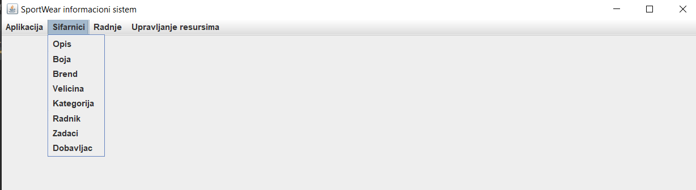
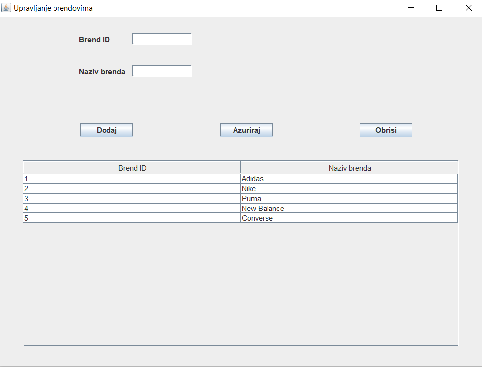
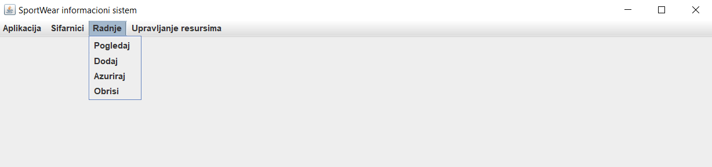
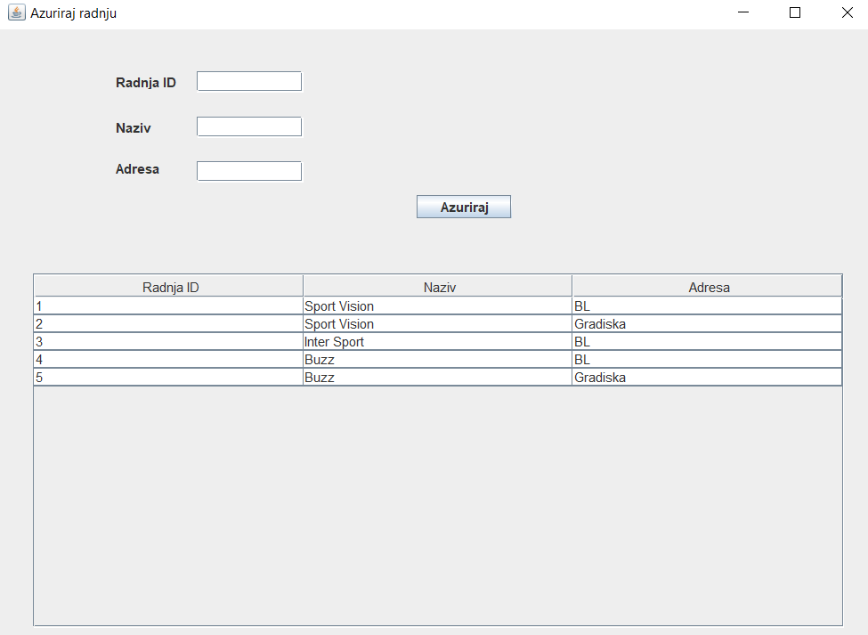
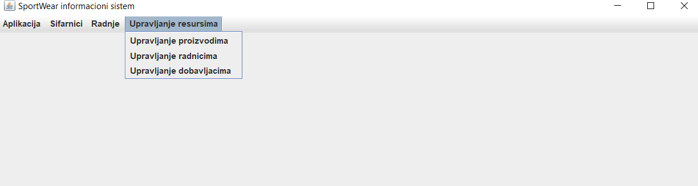
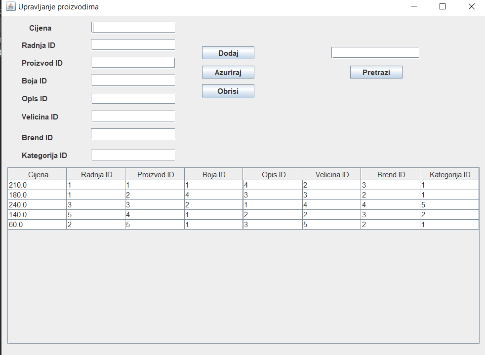
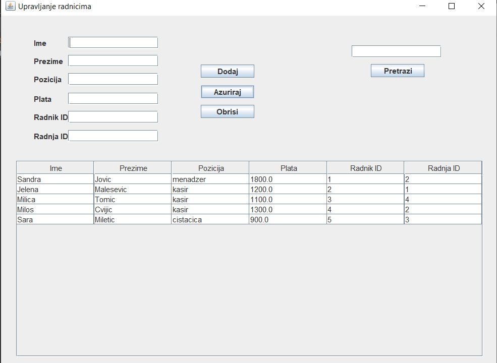
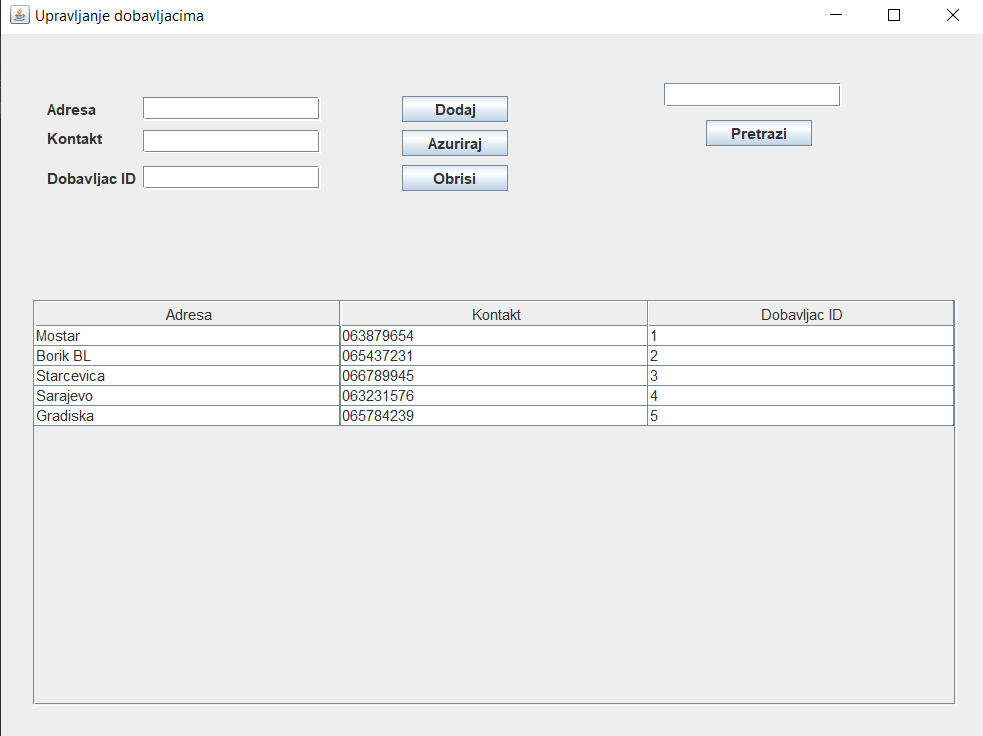

# SportsShop
## Description
University project in the form of a Swing GUI application implemented in Java. An application that allows employees to work with sportswear and footwear in a simple and intuitive way. Operations for creating new products, workers, suppliers are enabled. Theirs is enabled updating, reading, searching, and of course deleting.
## Reference to the detailed description
Detailed description of the project can be found in the folder "Description".
## Screenshots

